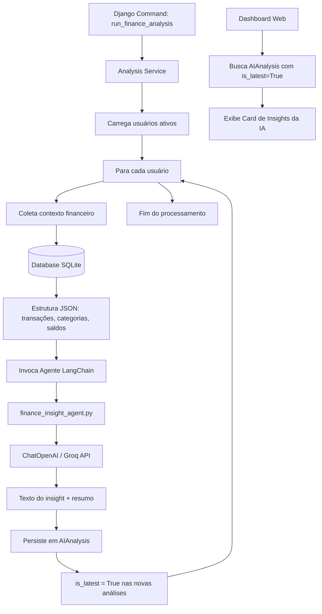

# Agente de IA Financeiro

Este documento explica o funcionamento, a arquitetura e a integração do **Agente de IA Financeiro** no Finanpy.

---

## 🎯 Visão Geral

A funcionalidade do Agente de IA Financeiro foi desenhada para ir além da exibição passiva de gráficos e saldos. Ela fornece aos usuários **insights e recomendações personalizadas** com base em seus próprios dados financeiros (transações, receitas, despesas e categorias) de forma proativa.

> [!NOTE]
> Esta funcionalidade é orquestrada através do app `ai`, que isola as lógicas de inteligência artificial, conexão com o LLM via LangChain e armazenamento de histórico.

---

## ⚙️ Funcionamento e Fluxo do Processo

A geração de insights segue um fluxo fechado e seguro, garantindo que o agente analise apenas as informações relevantes do respectivo usuário.



### Detalhamento das Etapas:

1. **Início da Execução**: O processo é disparado via Django Management Command (`run_finance_analysis`).
2. **Coleta de Contexto**: Para cada usuário, o `analysis_service.py` executa queries otimizadas para levantar o histórico financeiro dos últimos 30 dias:
   - Saldos consolidados de todas as contas.
   - Totais agregados de receitas e despesas.
   - Distribuição de gastos por categoria.
   - Listagem de transações recentes.
3. **Invocação do Agente**: O agente é inicializado com um *System Prompt* específico (agindo como um planejador financeiro pessoal) e recebe as informações estruturadas.
4. **Resolução de Tools**: Se necessário, o agente pode invocar tools específicas do LangChain para aprofundar a busca de dados.
5. **Persistência**: O resultado gerado é salvo na tabela `AIAnalysis` associada ao usuário. O sistema marca a nova análise como `is_latest=True` e desativa o flag nas análises antigas do mesmo usuário.
6. **Exibição**: Quando o usuário acessa o **Dashboard**, a view do dashboard busca a análise onde `is_latest=True` e a exibe em um card de destaque na UI.

---

## 💻 Como Executar o Django Command

A execução da análise é realizada de forma assíncrona/batch através de um comando administrativo do Django:

```bash
# Executa a análise para todos os usuários ativos do sistema
python manage.py run_finance_analysis
```

### Opções de Execução futuras (Sprint Roadmap):
- `--user_id <id>`: Permite gerar a análise exclusivamente para o usuário indicado.
- `--force`: Força a re-geração da análise desconsiderando caches temporais.

---

## 🛠️ Detalhes da Integração com LangChain 1.0

A integração com a Inteligência Artificial utiliza a biblioteca **LangChain 1.0** configurada para interagir com endpoints compatíveis com a API da OpenAI.

### Configuração do LLM (Groq / OpenAI)

O agente utiliza a classe `ChatOpenAI` do pacote `langchain_openai`. Isso permite que possamos apontar o agente tanto para a **Groq API** (usando o modelo `llama-3.3-70b-versatile` ou similar de baixíssima latência) quanto para a própria **OpenAI** (usando o `GPT-5-mini` ou similar).

As chaves e variáveis de ambiente necessárias no `.env` são:

```env
# Configuração para Groq API (Padrão)
GROQ_API_KEY=sua_chave_groq_aqui
GROQ_BASE_URL=https://api.groq.com/openai/v1

# Configuração para OpenAI API (Alternativa)
OPENAI_API_KEY=sua_chave_openai_aqui
```

### Agente ReAct e Tools

O arquivo `ai/agents/finance_insight_agent.py` define o agente e suas tools utilizando `@tool` do LangChain:
- `get_user_accounts(user_id)`: Retorna as contas e saldos do usuário.
- `get_user_transactions(user_id)`: Retorna o extrato do usuário.
- `get_user_categories(user_id)`: Retorna as categorias de despesas/receitas do usuário.

---

## ⚠️ Manutenção e Expansão Futura

Ao realizar alterações ou expansões no módulo de IA, siga as seguintes diretrizes:

> [!IMPORTANT]
> **Isolamento de Dados**: As tools e funções do serviço devem obrigatoriamente validar que o `user_id` consultado é idêntico ao do usuário que está sob análise. Nunca exponha dados de um usuário para a análise de outro.

> [!WARNING]
> **Limites de Rate Limit e Tokens**: O volume de dados enviado para o LLM deve ser controlado. Não envie históricos de anos em uma única análise. Se necessário, agregue os dados previamente antes de alimentar as tools.

### Próximos Passos recomendados:
1. **Agendamento com Celery**: Automatizar a chamada do comando administrativamente uma vez por semana (ex: todo domingo às 23:59).
2. **Histórico na UI**: Criar uma página dedicada para o usuário navegar pelo histórico de análises anteriores (`AIAnalysis.objects.filter(user=user)`).
3. **Feedback Loops**: Adicionar botões de "Insight útil" (Gostei/Não Gostei) na UI para avaliar e refinar os prompts do agente no futuro.
